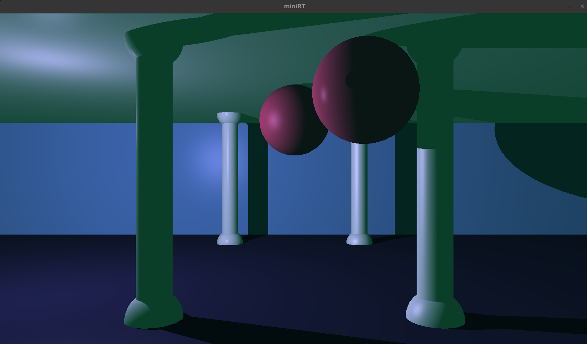

# The "miniRT" project
miniRT is a simple raytracer project which we implemented as part of the 42 core curriculum. The program reads configuration information from a file and displays a corresponding image using raytracing techniques. The program is written in C.

## Background: raytracing
Raytracing is a specific form of rendering. The book "Physically Based Rendering" describes rendering as "a fundamental component of computer graphics. At the highest level of abstraction, rendering is the process of converting a description of a three-dimensional scene into an image."

## Usage
In order to run the program, you have to type 'make' and then './miniRT <configuration file name>'
You can try our test files - for example:
./miniRT scenes/pillars.rt
./miniRT scenes/marbles.rt
./miniRT scenes/light_behind_plane.rt

## Project objectives

## Allowed functions
As in most 42 projects we were restricted in the functions and libraries we were allowed to use for the project. Allowed functions for this project were:

- The basic system functions `open()`, `close()`, `read()`, `write()`, `printf()`, `malloc()`, `free()`, `perror()`, `strerror()`, `exit()`
- All functions of the math library (-lm man man 3 math)
- All functions of the minilibX-library, which is a simple window management library supplied by 42
- Additionally we were allowed to use all previous functions that we had written for previous projects (our "libft"). These functions are mainly built on the basic functions listed above.

## Configuration file / scene description
The configuration of the scene is provided in a simple text file, which contains key information on the objects to be displayed, lighting conditions, etc.

Specifically, each text file can or must contain:
- description of ambient lighting, which is indicated by an "A" in the text file. It essentially describes the share / ratio of ambient lighting and its RGB color in the following format: `A 0.2 255,255,255`
- description of the camera / viewpoint, which is indiated by a "C" and contains information on its location in space, the direction it is pointed in (a normalized orientation vector) and the angle visible from that viewpoint: `C -50.0,0,20 0,0,1 70`
- description of a direct light source, which is indicated by an "L" and contains information on its location in space and an indicator for the "light brightness ratio". For the bonus part of the project the light source may optionally have a specific RGB color. The format is hence defined as `L -40.0,50.0,0.0 0.6` in the basic implementation and `L -40.0,50.0,0.0 0.6 10,0,255` for the bonus implementation.
- description of objects, which can all appear multiple times in a scene (unlike the previous elements)
	- sphere
	- plane
	- cylinder

## Our architecture
Quick walkthrough
Main data structures used

Use of minilibx
Viewport and ray calculation
Hit point calculation
Hit point colors

## Display management (minilibx)
## Parsing of configuration file
During the parsing of the config file, we make sure that all specifications necessary to render a scene are present and within usable bounds. 
There needs to be exactly one camera (C) and at least either one ambient light source (A) or/and one direct light (L).
There can be as many spheres (sp), cylinders (cy) or planes (pl) as wanted.

## Viewport and ray calculation
## Hit point calculation
To calculate the intersection of a ray originating from the camera center with an object, we use vector math. If the vision ray does not hit any object, the background color will be set. For every object (sphere, cylinder or plane) we can compute the exact coordinates of the point of intersection with the ray, using the object-specific formulas.

## Hit point colors
For every hit point, a shadow ray is cast (a vector from hit point towards light source). If the way to the light source is free and there is no other object blocking the light, we calculate the diffuse light. The cosine of the angle between the object's surface normal and the light direction will indicate how diffusely the light is reflected on that spot.
--> diffuse=max(0,cos(θ))=max(0,N⋅L)

In order to represent how the object reflects or absorbs the direct and ambient lights, we first multiply the object color with the ambient light contribution (intensity and color). If the hit point is not in any other object's shadow, we also mix in the diffuse light contribution in the same way. 
We also added specular light reflection, which takes into account the point of view and varies depending on the position of the ray origin and the object's surface (the smoother the surface the shinier the reflection).

## Issues encountered in implementation
- Math dependent on coordinate system

- Debugging with large amount of different rays

Due to the high amount of iterations that the program needs to render a scene, it was tricky to debug with print statements, as for every hit point, the specs are entirely different and we were not able to verify if the calculations made were correct. 
To overcome this problem, we implemented a test function, which issued only one ray sent to a very specific point in the scene and placed an object in its way or not so that we could exactly determine if the hit point coordinates, angles, norm vectors, color calculations etc. were correct.

## What we learned!
